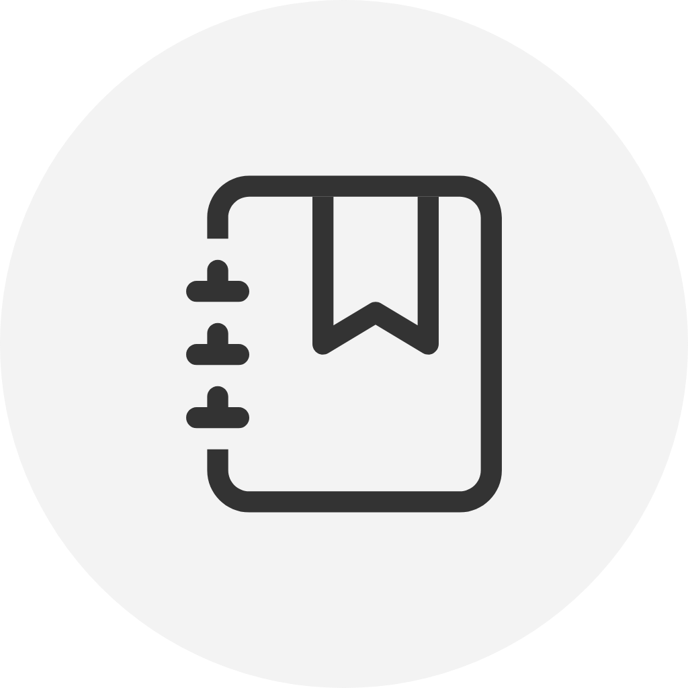

<!-- Improved compatibility of back to top link: See: https://github.com/othneildrew/Best-README-Template/pull/73 -->
<a id="readme-top"></a>
<!--
*** Thanks for checking out the Best-README-Template. If you have a suggestion
*** that would make this better, please fork the repo and create a pull request
*** or simply open an issue with the tag "enhancement".
*** Don't forget to give the project a star!
*** Thanks again! Now go create something AMAZING! :D
-->


<!-- PROJECT SHIELDS -->
<!--
*** I'm using markdown "reference style" links for readability.
*** Reference links are enclosed in brackets [ ] instead of parentheses ( ).
*** See the bottom of this document for the declaration of the reference variables
*** for contributors-url, forks-url, etc. This is an optional, concise syntax you may use.
*** https://www.markdownguide.org/basic-syntax/#reference-style-links
-->

[![MIT License][license-shield]][license-url]


<!-- PROJECT LOGO -->
<br />
<div align="center">
  <a href="https://emodialog.live">
    
  </a>

  <h3 align="center">EmoDialog</h3>
  <h4 align="center">EmotionAI for the rest of us.</h4> 
  <br />
  <p align="center">
    AI日記アプリ
    <br />
    A Personalized Diary App with Generative AI
  </p>
</div>

<!-- ABOUT THE PROJECT -->
## プロジェクトについて（About The Project）

[![Product Name Screen Shot][product-screenshot]](https://emodialog.live)

There are many great README templates available on GitHub; however, I didn't find one that really suited my needs so I created this enhanced one. I want to create a README template so amazing that it'll be the last one you ever need -- I think this is it.

Here's why:
* Your time should be focused on creating something amazing. A project that solves a problem and helps others
* You shouldn't be doing the same tasks over and over like creating a README from scratch
* You should implement DRY principles to the rest of your life :smile:

_"EmoDialog"の名前由来は，"Emo" は感情（emotion）を表し，"Dialog" は対話（dialogue）を表す言葉です．この名前は，感情を中心に据えた対話やコミュニケーションを促進するアプリケーションを示しています．感情と対話を融合させることで，ユーザーが自分の感情や思考をより深く理解し，整理する手助けをすることを意味しています．_

<p align="right">(<a href="#readme-top">back to top</a>)</p>


### 技術スタック（Built With）

現段階で，EmoDialogは以下の技術スタックを使用して開発されています．

* [![Python][Python.org]][Python-url]
* [![Flask][Flask.palletsprojects]][Flask-url]
* [![OpenAI][openai.com]][openai-url]
* [![SQLite][sqllite]][sqllite-url]
* [![Vue][Vue.js]][Vue-url]
* [![Bootstrap][Bootstrap.com]][Bootstrap-url]
<p align="right">(<a href="#readme-top">back to top</a>)</p>


<!-- GETTING STARTED -->
## はじめに（Getting Started）

このプロジェクトはサーバーでの実行を前提としていますが，Pythonの環境があればローカルでの実行も可能です．
ただし，OpenAIのAPIを使用しているため，事前にAPIキーの取得が必要です．
（※APIキーの取得にはOpenAI社へのクレジットカード情報の登録が必須です．）

またデモページも用意していますので，以下のリンクからアクセスしてみてください．
**EmoDialog(https://emodialog.live)**
_（注意: 本ページはデモ環境のため，データベースが定期的に初期化されます．）_

以下のサンプルアカウントでログインすることで，予め記録された日記や感情分析を閲覧・編集することができます．
`ユーザー名：guest`
`パスワード：psp4_sample`

### 導入（Installation）

_ここではローカル環境でのプロジェクトの導入方法について説明します．_

1. OpenAI APIキーを取得し環境変数に設定する．参考 [OpenAI Platform](https://platform.openai.com)
    ```sh
    export OPENAI_API_KEY='YOUR_API_KEY'
    ```
2. リポジトリをクローンする
   ```sh
    git clone https://github.com/ut42univ/EmoDialog.git
   ```
3. 必要なパッケージをインストールする（仮想環境での実行を推奨）
   ```sh
    pip install -r requirements.txt
   ```
4. 実行する
    ```sh
      cd app
      python app.py
    ```
5. ブラウザで以下のURLにアクセスする（デフォルトはポート5000）
    ```sh
    http://localhost:5000
    ```

<p align="right">(<a href="#readme-top">back to top</a>)</p>


<!-- USAGE EXAMPLES -->
## 使用方法（Usage）

Use this space to show useful examples of how a project can be used. Additional screenshots, code examples and demos work well in this space. You may also link to more resources.

_For more examples, please refer to the [Documentation](https://example.com)_

<p align="right">(<a href="#readme-top">back to top</a>)</p>

<!-- LICENSE -->
## ライセンス（License）

Distributed under the MIT License. See `LICENSE` for more information.

<p align="right">(<a href="#readme-top">back to top</a>)</p>


<!-- MARKDOWN LINKS & IMAGES -->
<!-- https://www.markdownguide.org/basic-syntax/#reference-style-links -->
[contributors-shield]: https://img.shields.io/github/contributors/othneildrew/Best-README-Template.svg?style=for-the-badge
[contributors-url]: https://github.com/othneildrew/Best-README-Template/graphs/contributors
[forks-shield]: https://img.shields.io/github/forks/othneildrew/Best-README-Template.svg?style=for-the-badge
[forks-url]: https://github.com/othneildrew/Best-README-Template/network/members
[stars-shield]: https://img.shields.io/github/stars/othneildrew/Best-README-Template.svg?style=for-the-badge
[stars-url]: https://github.com/othneildrew/Best-README-Template/stargazers
[issues-shield]: https://img.shields.io/github/issues/othneildrew/Best-README-Template.svg?style=for-the-badge
[issues-url]: https://github.com/othneildrew/Best-README-Template/issues
[license-shield]: https://img.shields.io/github/license/othneildrew/Best-README-Template.svg?style=for-the-badge
[license-url]: https://github.com/ut42univ/EmoDialog/blob/main/LICENSE
[linkedin-shield]: https://img.shields.io/badge/-LinkedIn-black.svg?style=for-the-badge&logo=linkedin&colorB=555
[linkedin-url]: https://linkedin.com/in/othneildrew
[product-screenshot]: images/screenshot.png
[Next.js]: https://img.shields.io/badge/next.js-000000?style=for-the-badge&logo=nextdotjs&logoColor=white
[Next-url]: https://nextjs.org/
[React.js]: https://img.shields.io/badge/React-20232A?style=for-the-badge&logo=react&logoColor=61DAFB
[React-url]: https://reactjs.org/
[Vue.js]: https://img.shields.io/badge/Vue.js-35495E?style=for-the-badge&logo=vuedotjs&logoColor=4FC08D
[Vue-url]: https://vuejs.org/
[Angular.io]: https://img.shields.io/badge/Angular-DD0031?style=for-the-badge&logo=angular&logoColor=white
[Angular-url]: https://angular.io/
[Svelte.dev]: https://img.shields.io/badge/Svelte-4A4A55?style=for-the-badge&logo=svelte&logoColor=FF3E00
[Svelte-url]: https://svelte.dev/
[Laravel.com]: https://img.shields.io/badge/Laravel-FF2D20?style=for-the-badge&logo=laravel&logoColor=white
[Laravel-url]: https://laravel.com
[Bootstrap.com]: https://img.shields.io/badge/Bootstrap-563D7C?style=for-the-badge&logo=bootstrap&logoColor=white
[Bootstrap-url]: https://getbootstrap.com
[JQuery.com]: https://img.shields.io/badge/jQuery-0769AD?style=for-the-badge&logo=jquery&logoColor=white
[JQuery-url]: https://jquery.com 
[Python.org]: https://img.shields.io/badge/Python-3776AB?style=for-the-badge&logo=python&logoColor=white
[Python-url]: https://www.python.org/
[Flask.palletsprojects]: https://img.shields.io/badge/Flask-000000?style=for-the-badge&logo=flask&logoColor=white
[Flask-url]: https://flask.palletsprojects.com/
[sqllite]: https://img.shields.io/badge/SQLite-07405E?style=for-the-badge&logo=sqlite&logoColor=white
[sqllite-url]: https://www.sqlite.org/index.html
[openai.com]: https://img.shields.io/badge/OpenAI-F2F2F2?style=for-the-badge&logo=openai&logoColor=black
[openai-url]: https://www.openai.com/
[Heroku.com]: https://img.shields.io/badge/Heroku-430098?style=for-the-badge&logo=heroku&logoColor=white
[Heroku-url]: https://www.heroku.com/
[Google Cloud]: https://img.shields.io/badge/Google_Cloud-4285F4?style=for-the-badge&logo=google-cloud&logoColor=white
[Google Cloud-url]: https://cloud.google.com/
[matplotlib]: https://img.shields.io/badge/Matplotlib-3776AB?style=for-the-badge&logo=python&logoColor=white
[matplotlib-url]: https://matplotlib.org/