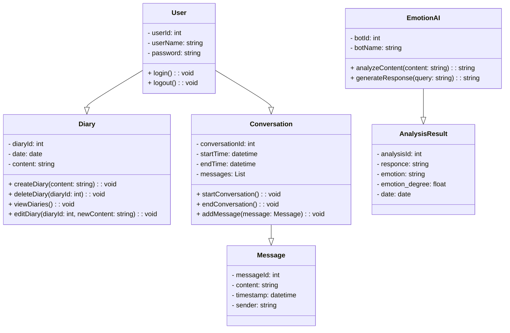

```mermaid
classDiagram
    class User {
        - userId: int
        - userName: string
        - password: string
        + login(): void
        + logout(): void
    }
    class Diary {
        - diaryId: int
        - date: date
        - content: string
        + createDiary(content: string): void
        + deleteDiary(diaryId: int): void
        + viewDiaries(): void
        + editDiary(diaryId: int, newContent: string): void
    }
    class EmotionAI {
        - botId: int
        - botName: string
        + analyzeContent(content: string): string
        + generateResponse(query: string): string
    }
    class AnalysisResult {
        - analysisId: int
        - responce: string
        - emotion: string
        - emotion_degree: float
        - date: date
    }
    class Conversation {
        - conversationId: int
        - startTime: datetime
        - endTime: datetime
        - messages: List<Message>
        + startConversation(): void
        + endConversation(): void
        + addMessage(message: Message): void
    }
    class Message {
        - messageId: int
        - content: string
        - timestamp: datetime
        - sender: string
    }

    User --|> Diary
    User --|> Conversation
    EmotionAI --|> AnalysisResult
    Conversation --|> Message
```
